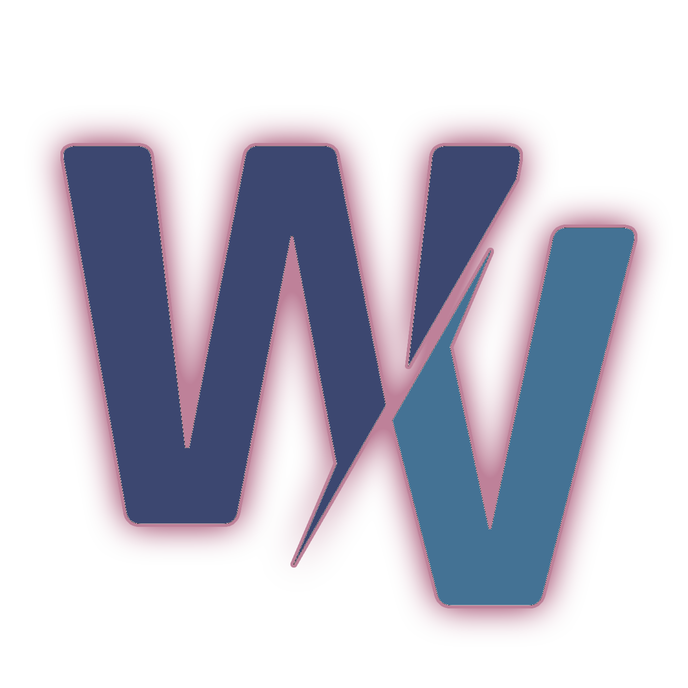
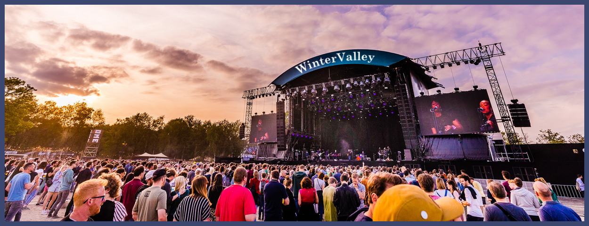
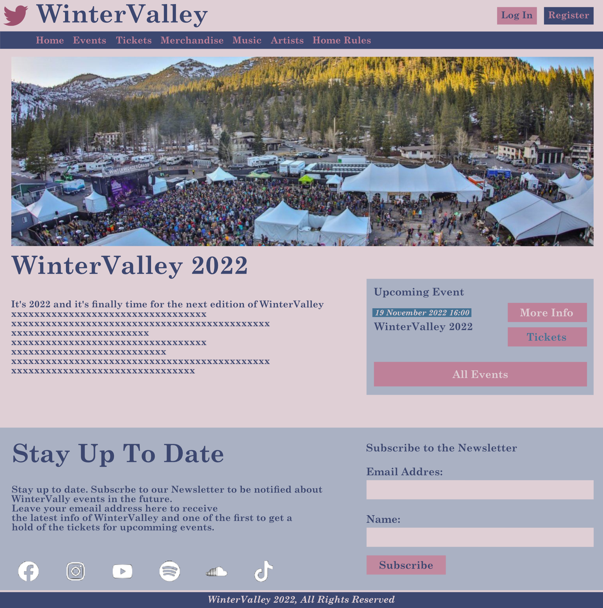
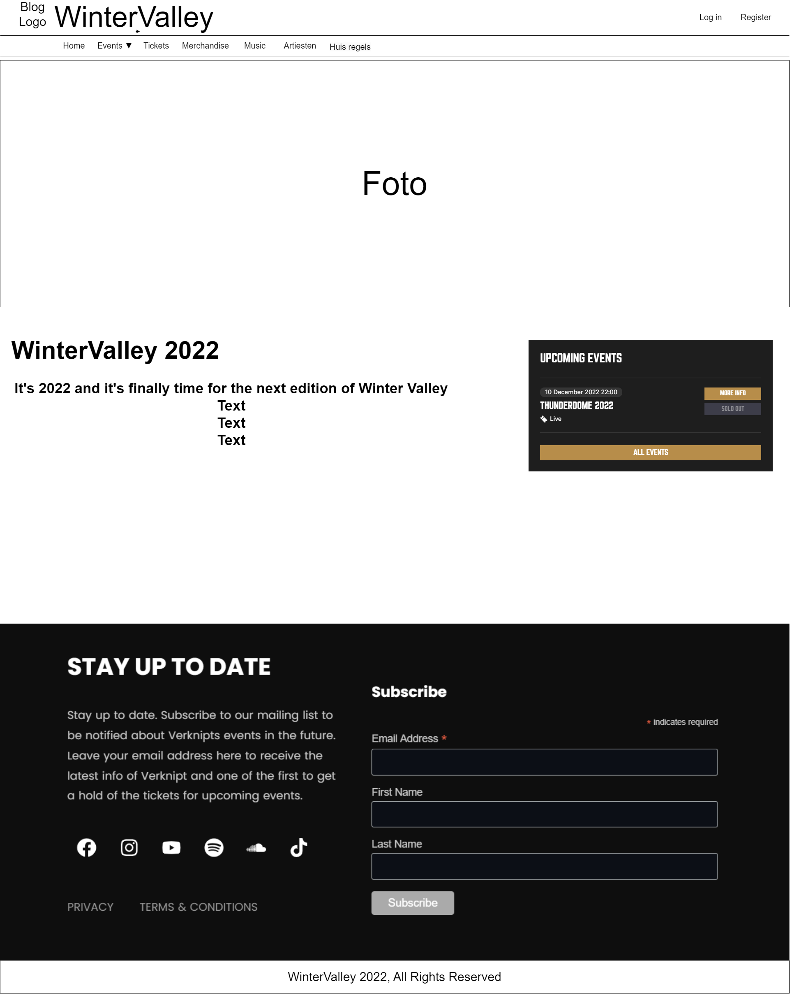
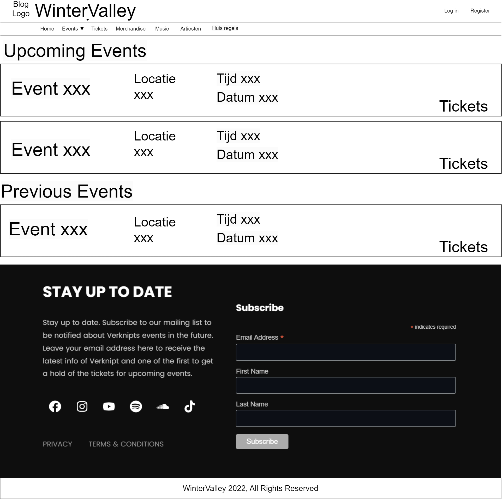
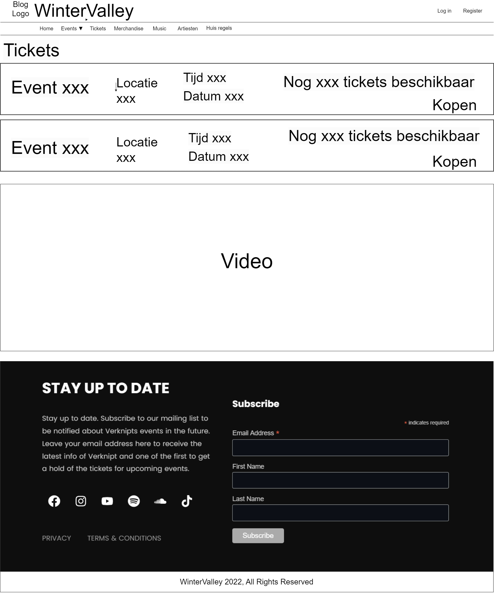
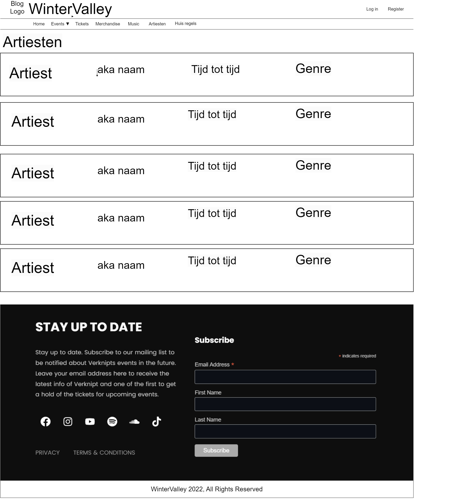
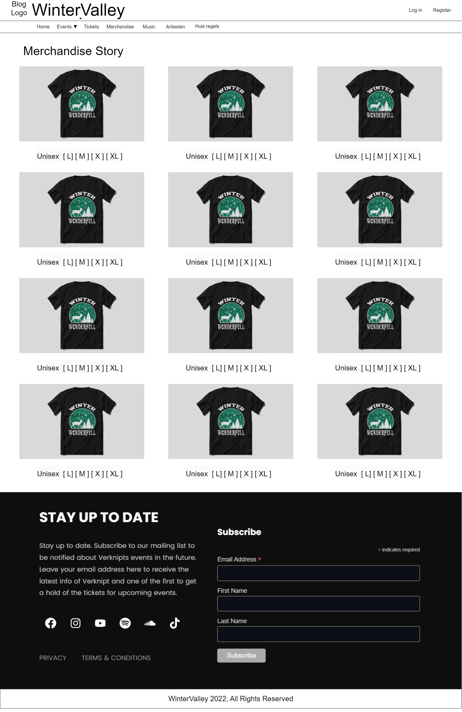
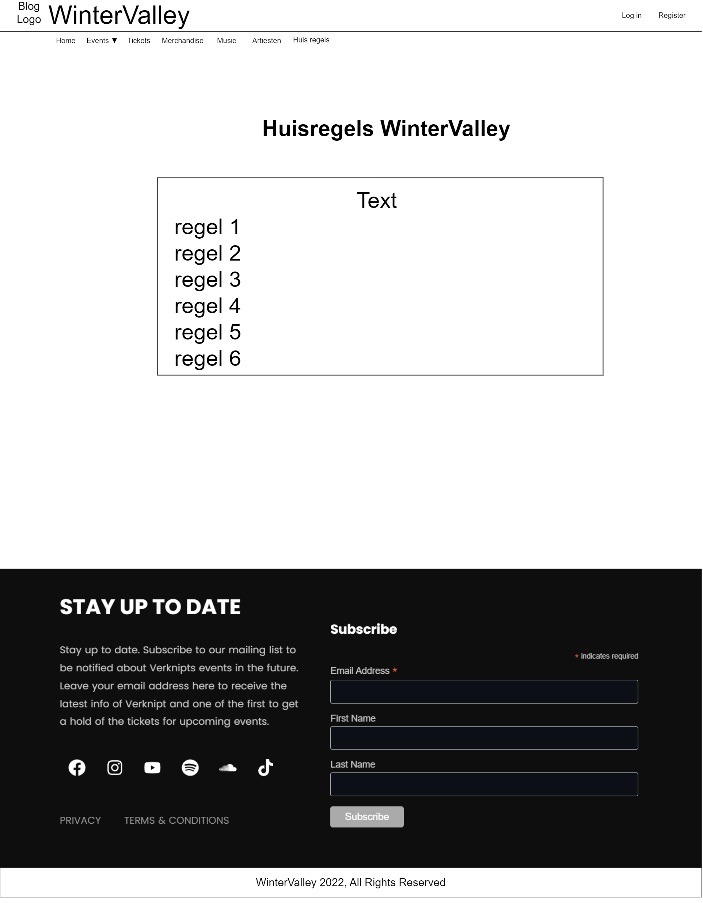

<!-- -- -- -- -- -- -- -- -- -- -- -- -- -- -- -- -- -- -- -- -- -- -- -->

# Wintervalley

Het maken van een website voor een festival zoals Wintervalley was een leuke ervaring voor ons team, om zowel het ticketverkoop als de merchandise verkoop soepel te laten verlopen. Een goed ontworpen website kan Wintervalley helpen bij het aantrekken van meer bezoekers en het vergroten van de naamsbekendheid, terwijl het ook de online verkoop van tickets en merchandise kan bevorderen.

Naast de functionaliteit voor ticketverkoop en merchandise, kan de website van Wintervalley ook belangrijke informatie bieden over de artiesten die optreden, het schema van de verschillende optredens die tijdens het festival plaatsvinden. Dit kan potentiële bezoekers helpen bij het plannen van hun bezoek en zorgen voor een betere festivalervaring.

Daarnaast kan de website van Wintervalley ook sociale media-integratie bieden, waardoor festivalgangers op de hoogte kunnen blijven van de laatste updates en nieuws over het festival. Dit kan helpen om een gemeenschap van festivalgangers op te bouwen en de betrokkenheid van bezoekers bij het festival te vergroten.

Kortom, het creëren van een effectieve website voor Wintervalley kan een belangrijke bijdrage leveren aan het succes van het festival en de tevredenheid van de bezoekers.

We hebben de volgende talen gebruikt voor het bouwen van deze website:
HTML, CSS, JS, PHP, PDO & SQL

 

<!-- -- -- -- -- -- -- -- -- -- -- -- -- -- -- -- -- -- -- -- -- -- -- -->

## 👥 Scrum Team:

- [Joris](https://github.com/139388-Joris-Taam), [Michel](https://github.com/Michel-3),
[Robin](https://github.com/RobinBosma) & [Roger](https://github.com/Rogerdark)

 

<!-- -- -- -- -- -- -- -- -- -- -- -- -- -- -- -- -- -- -- -- -- -- -- -->

## 📃 Links

- [TrelloBord](https://trello.com/invite/b/XFYIIAMm/ATTI1f197476f1e8b5aae41bfd277c101a620C367A0D/scrum-bord)
- [Github](https://github.com/horizoncollege/project-1-basis-scrum-wintervalley) 
- [Online Pagina](www.wintervalleyfestival.com)

 

<!-- -- -- -- -- -- -- -- -- -- -- -- -- -- -- -- -- -- -- -- -- -- -- -->

## 🛠 Development

De eerste week probeerde we de HTML en CSS kant van de pagina af te maken.
Dag 1 van het project werkte we vooral aan de Sketch. Die kregen we af.
De rest van de dagen hadden we het meeste HTML en CSS af met nog een paar
kleine onderdeeltjes die afgerond moesten worden.

De tweede week gingen we verder met het stylen van de pagina.
Na een paar dagen was dat ook helemaal afgerond en waren we verder gegaan met de inhoud.
Daarna hadden we nog de Login en Register knoppen gemaakt en werkend gemaakt.
En hadden we nog een nieuws pagina toegevoegd.
Daarnaast hadden we Huisregels in een data base gezet

De Derde week hadden we de styling van login en register gemaakt.
En ook de nieuws pagina's verder gestyled.
Daarnaast hadden we artietsen en de nieuws pagina's in een Database gezet.
En een start gemaakt om tickets en merch te kunnen kopen.

De vierde week waren we verder gegaan met het Ticket en merch systeem.
Vervolgens hadden we de laatste aanpassingen van merch aangepast qua style.
En hadden we de README helemaal afgemaakt.

 

<!-- -- -- -- -- -- -- -- -- -- -- -- -- -- -- -- -- -- -- -- -- -- -- -->

## 🤝🏻 Taakverdeling

### 📌 Week 1

Open - Sluiten

 

- [Joris](https://github.com/139388-Joris-Taam) Joris had een sketch gemaakt voor Merchandise en de footer,  en heeft dit gemaakt naar een HTML en CSS pagina. Hij heeft ook voor de Navbar en Footer een include gemaakt.
- [Michel](https://github.com/Michel-3) Michel had de sketch voor Event en Tickets gemaakt,  en heeft deze tot een HTML en CSS pagina gemaakt.  Vervolgens heeft hij alle pagina's gevuld met foto's en locatie/tijd informatie.
- [Robin](https://github.com/RobinBosma) Robin had de homepagina sketch gemaakt met de navbar,  en heeft dit tot een HTML en CSS pagina verwerkt.
- [Roger](https://github.com/Rogerdark) Roger had een sketch voor de Artiesten en Huis Regels gemaakt,  Vervolgens heeft hij deze tot een HTML en CSS pagina verwerkt.  Hij heeft ook een start gemaakt aan de inhoud en  gekozen welke artiesten komen opdagen.

 

<!-- -- -- -- -- -- -- -- -- -- -- -- -- -- -- -- -- -- -- -- -- -- -- -->

### 📌 Week 2

Open - Sluiten

 

- [Joris](https://github.com/139388-Joris-Taam) Joris heeft knoppen voor Login en Register gemaakt.  En probeerde het te laten werken.
- [Michel](https://github.com/Michel-3)  Michel heeft meer Events toegevoegd en daarbij ook de Tickets,  daarbij heeft hij ook alles wat ermee te maken heeft gestyled.
- [Robin](https://github.com/RobinBosma)  Robin begon met het maken van een nieuws pagina gemaakt.
- [Roger](https://github.com/Rogerdark) Roger heeft de Login en Register werkend gemaakt.  Met inloggen, uitloggen en account maken.  Vervolgens heeft hij ook nog Regels toegevoegd bij huisregels.

 

<!-- -- -- -- -- -- -- -- -- -- -- -- -- -- -- -- -- -- -- -- -- -- -- -->

### 📌 Week 3

Open - Sluiten

 

- [Joris](https://github.com/139388-Joris-Taam) Joris heeft een SQL Database gemaakt voor Tickets met Michel.
- [Michel](https://github.com/Michel-3) Michel heeft een SQL Database gemaakt voor Tickets met Joris.
- [Robin](https://github.com/RobinBosma) Robin had zijn nieuws pagina's tekst gegeven.  En hij heeft ook nog de Login en Register gestyled.  Hij heeft ook nog toegevoegd dat de gebruiker op de nieuwsbrief kan abboneren.  En ook nog extra huisregels toegevoegd.
- [Roger](https://github.com/Rogerdark) Roger heeft een error knop gemaakt voor login (indien fout wachtwoord ect.)  en heeft alle huisregels in een database gezet.

 

<!-- -- -- -- -- -- -- -- -- -- -- -- -- -- -- -- -- -- -- -- -- -- -- -->

### 📌 Week 4

Open - Sluiten

 

- [Joris](https://github.com/139388-Joris-Taam) Joris was verder gegeaan met het Ticket systeem en heeft dat afgrond.  Vervolgens heeft hij dit geimplementeert naar de Merch pagina.
- [Michel](https://github.com/Michel-3) Michel was verder gegaan met het Ticket systeem.  Dit heeft hij vervolgens werkent gemaakt en de popup van tickets weggehaalt.
- [Robin](https://github.com/RobinBosma) Robin heeft een pop-up gemaakt en gestyled voor Tickets en Merch.  Vervolgens heeft hij de popup weer weggehaalt en de popup in de pagina gezet.  Daarna ging hij de ReadME maken.
- [Roger](https://github.com/Rogerdark) Roger heeft de Artiesten, en alle nieuws pagina's in een Database gedaan.  Vervolgens is hij verder gaan helpen met het Ticket en Merch Systeem.

 

 

<!-- -- -- -- -- -- -- -- -- -- -- -- -- -- -- -- -- -- -- -- -- -- -- -->

## 📝 Sketch

Dit was een Template die we na de Draw.io sketch hadden gemaakt
om beter te kijken hoe de pagina er uiteindelijk uit komt te zien

Gemaakt met [Affinity Photos](https://affinity.serif.com/en-gb/):

 

 

<!-- -- -- -- -- -- -- -- -- -- -- -- -- -- -- -- -- -- -- -- -- -- -- -->

Hier onze Draw.io sketch

Gemaakt met [Draw.io](https://app.diagrams.net/):

 

 
 
 

 

<!-- -- -- -- -- -- -- -- -- -- -- -- -- -- -- -- -- -- -- -- -- -- -- -->

## 🤫 Secrets

- Instagram logo linkt naar het Trellobord
- Twitter logo linkt naar Github
- Rechts in de navbar staat een secret knop ;)

 

<!-- -- -- -- -- -- -- -- -- -- -- -- -- -- -- -- -- -- -- -- -- -- -- -->

## 📃 licentie

This Project is [WinterValley](www.wintervalleyfestival.com) Licensed

 

